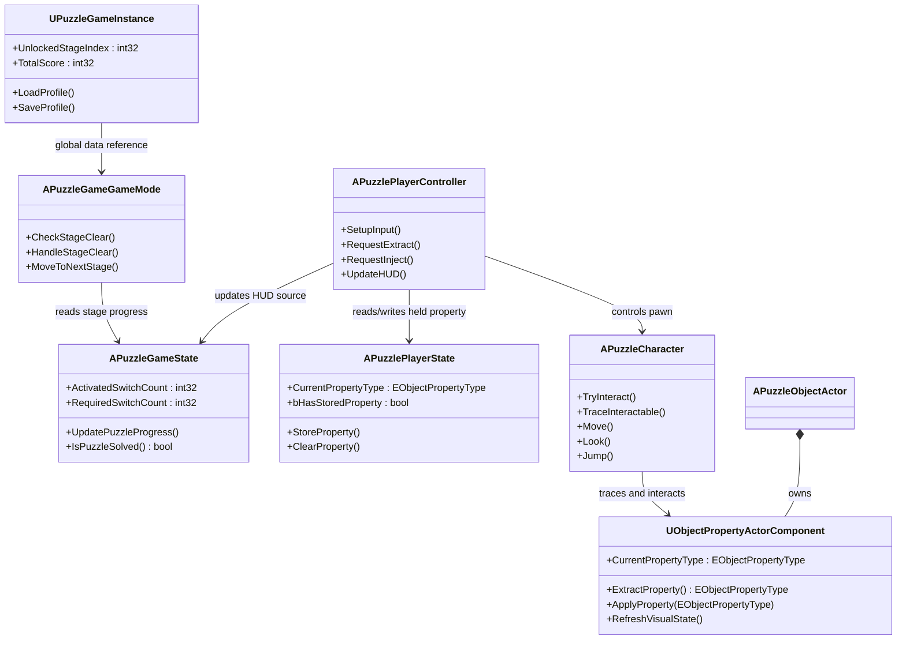
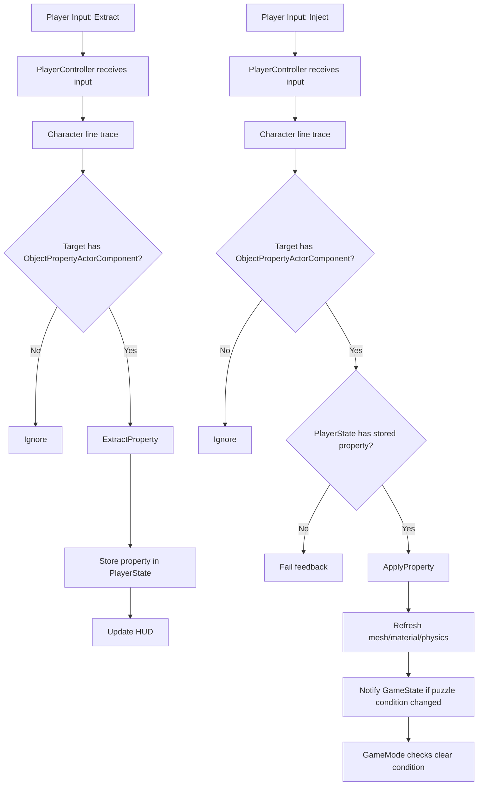

# PuzzleGame Architecture Plan

## 1. 목적

이 문서는 3D 플랫포머 퍼즐 프로젝트의 초기 구조를 빠르게 정리하기 위한 설계 초안이다.
오늘 작업 범위는 다음 네 가지다.

- 핵심 클래스 관계를 정리한 클래스 다이어그램 작성
- 속성 추출/부여 흐름을 정리한 시스템 다이어그램 작성
- UE5 C++ 클래스 뼈대 생성 범위 확정
- 폴더 구조와 작업 체크리스트 정리

---

## 2. 클래스 다이어그램



### 해석 기준

- `GameInstance`: 스테이지 간 유지되는 영속 데이터 담당
- `GameMode`: 현재 레벨 규칙과 클리어 처리 담당
- `GameState`: 현재 레벨 진행 상황 데이터 담당
- `PlayerState`: 플레이어가 보유 중인 속성 상태 담당
- `PlayerController`: 입력 처리와 HUD 갱신 요청 담당
- `Character`: 실제 월드 상호작용 담당
- `ObjectPropertyActorComponent`: 퍼즐 오브젝트 속성 로직 담당

---

## 3. 속성 추출/부여 흐름



---

## 4. 오늘 작업 체크리스트

```md
## 1. 프로젝트 기본 구조

- [ ] UE5 프로젝트 생성 상태 확인
- [ ] 기본 입력 시스템 설정 준비
- [ ] 기본 캐릭터 이동/점프 동작 유지 확인
- [ ] 폴더 구조 정리

## 2. 클래스 뼈대 생성

- [ ] `PuzzleGameInstance`
- [ ] `PuzzleGameGameMode`
- [ ] `PuzzleGameState`
- [ ] `PuzzlePlayerState`
- [ ] `PuzzlePlayerController`
- [ ] `PuzzleCharacter`
- [ ] `ObjectPropertyActorComponent`

## 3. 오늘 최소 구현 범위

- [ ] 각 클래스에 역할 주석 추가
- [ ] `GameMode`에 기본 클래스 연결 지점 정리
- [ ] `PlayerController`에 Extract/Inject 입력 함수 시그니처 추가
- [ ] `Character`에 LineTrace 상호작용 함수 시그니처 추가
- [ ] `ObjectPropertyActorComponent`에 Extract/Apply API 시그니처 추가

## 4. 이후 작업 예약

- [ ] 속성 enum 정의
- [ ] 상호작용 가능한 퍼즐 오브젝트 베이스 액터 설계
- [ ] HUD 위젯 연결
- [ ] 물성 변화 시각 효과 설계
- [ ] 퍼즐 클리어 판정 로직 구현
```

---

## 5. 권장 폴더 구조

```text
Source/PuzzleGame
├─ Core
│  ├─ PuzzleGameInstance.h/.cpp
│  ├─ PuzzleGameGameMode.h/.cpp
│  ├─ PuzzleGameState.h/.cpp
│  ├─ PuzzlePlayerState.h/.cpp
│  └─ PuzzlePlayerController.h/.cpp
├─ Character
│  └─ PuzzleCharacter.h/.cpp
├─ Interaction
│  ├─ Interfaces
│  └─ Trace
├─ Property
│  ├─ ObjectPropertyActorComponent.h/.cpp
│  ├─ ObjectPropertyTypes.h
│  └─ ObjectPropertyData.h
├─ Puzzle
│  ├─ Actors
│  └─ Devices
└─ UI
   ├─ HUD
   └─ Widgets
```

### 정리 원칙

- `Core`: 게임 프레임워크 객체 보관
- `Character`: 플레이어 캐릭터와 관련 기능 보관
- `Interaction`: LineTrace, 인터페이스, 상호작용 판정 보관
- `Property`: 속성 enum, 데이터, 컴포넌트 보관
- `Puzzle`: 퍼즐 장치, 스위치, 문, 이동 발판 등 보관
- `UI`: HUD, 위젯, 상태 표시 보관

---

## 6. 첫 구현 순서 제안

1. `Property` 폴더에 속성 enum부터 정의
2. `PlayerState`에 현재 보유 속성 저장 필드 추가
3. `ObjectPropertyActorComponent`에 Extract/Apply 함수 시그니처 추가
4. `Character`에 LineTrace 기반 대상 탐색 함수 추가
5. `PlayerController`에 Extract/Inject 입력 라우팅 추가
6. `GameState`, `GameMode`는 퍼즐 클리어 판정용 최소 시그니처만 먼저 추가

이 순서가 좋은 이유는 `속성 데이터 -> 상호작용 주체 -> 입력 연결 -> 스테이지 판정` 순으로 의존성이 흐르기 때문이다.
